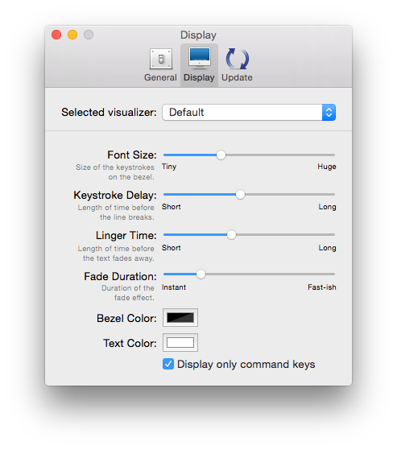
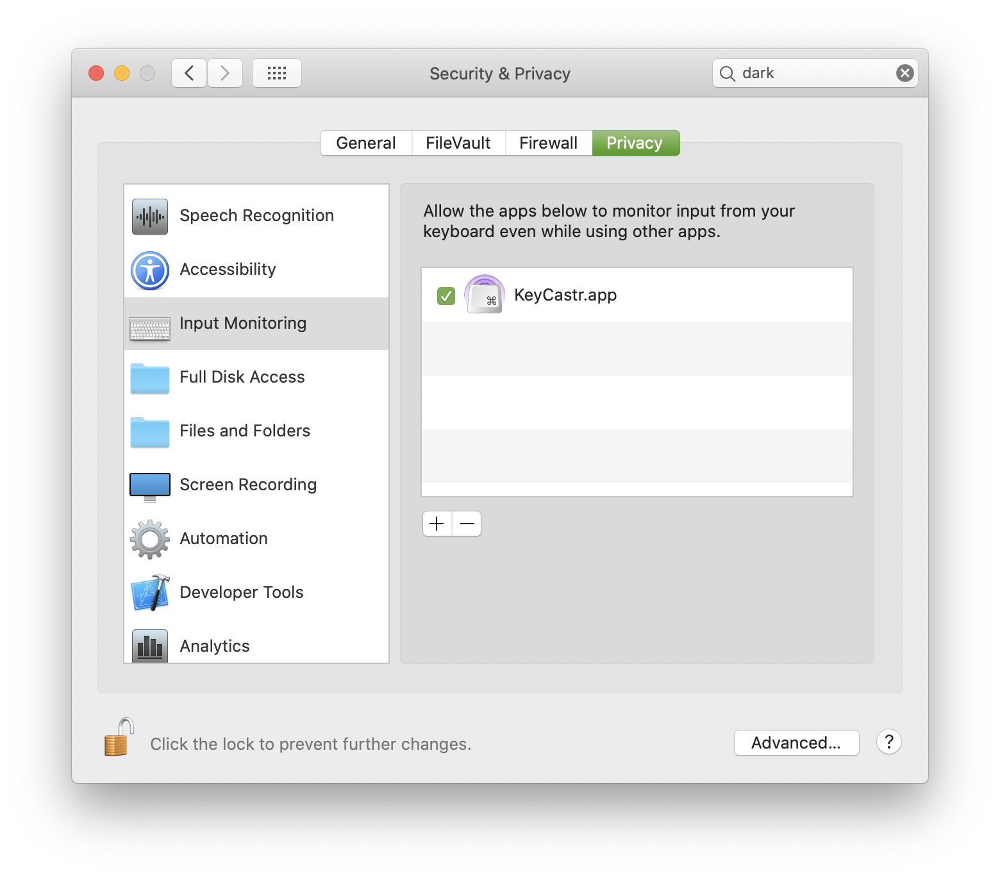
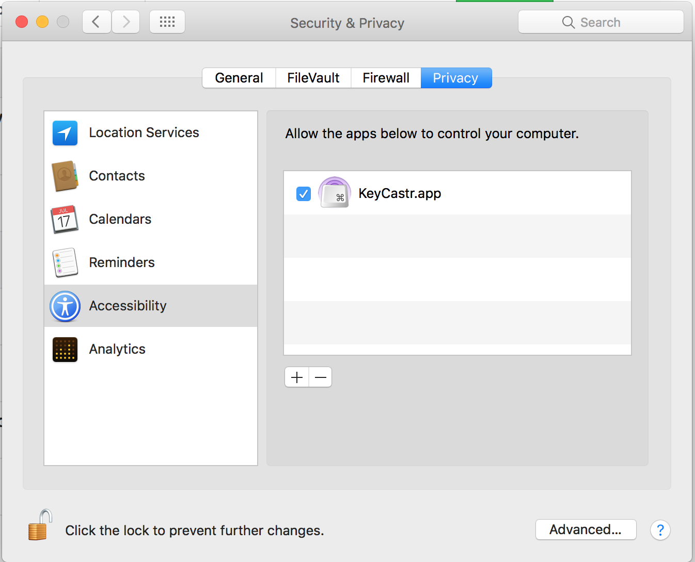

# Keycastr

KeyCastr, an open-source keystroke visualizer.




## Download

 - [Download latest release](https://github.com/keycastr/keycastr/releases)

## Installation via [homebrew](http://brew.sh/) [cask](https://github.com/caskroom/homebrew-cask)

```console
brew cask install keycastr
```

## Enabling Accessibility API Access

KeyCastr requires access to the macOS Accessibility API in order to receive your key events and broadcast the keystrokes you are interested in.

On newer versions of macOS (10.15+) there is a new Input Monitoring menu under Security & Privacy within the System Preferences app, and KeyCastr will appear there automatically the first time you run it. Simply unlock this menu and check the box next to KeyCastr to enable it.



On older versions of macOS, or if for some reason the app doesn't appear under the Input Monitoring menu (or if you want to pre-enable it) then you may manually add it to the list of apps in the Accessibility menu.



To add KeyCastr to the list click the <kbd>&plus;</kbd> button and select KeyCastr from the file system.

If KeyCastr is already in the list, then click the <kbd>&minus;</kbd> button and add KeyCastr again to be certain that the right application is chosen.

## Displaying All Keystrokes

Make sure to check the "Display all keystrokes" checkbox if you would like to display more than just the modifier keys.

Alternatively, keep this box unchecked to only display modifier keys (e.g. ⇧ ⌃ ⌥ ⌘)


## Position on Screen

The default position is on the bottom left of your display. To modify the position of displayed keystrokes, click and drag the text like so:


## History

 - [sdeken](https://github.com/sdeken/keycastr) wrote the original version.
 - [akitchen](https://github.com/akitchen/keycastr) fixes for more recent OS X releases and other maintenance.
 - [elia](https://github.com/elia/keycastr) created `keycastr` organization and forked into it.
 - [lqez](https://github.com/lqez/keycastr) added a new menu bar icon.


## License

[BSD 3-Clause](https://opensource.org/licenses/BSD-3-Clause)
